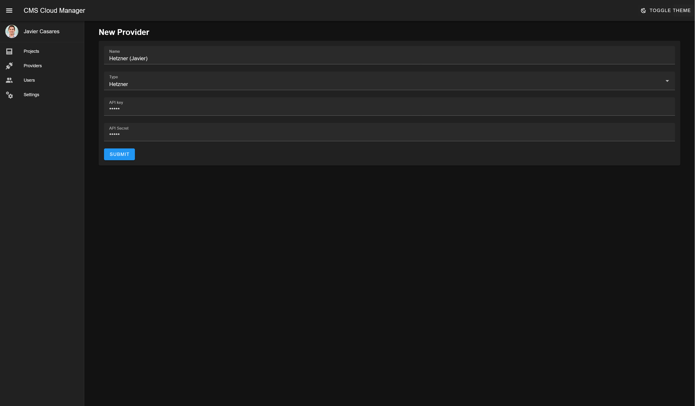

# CMS Cloud Manager: User documentation

The **CMS Cloud Manager** panel is very easy to use and features various tools for its operation.

## Supported Providers and CMS / Apps

### Providers

- Hetzner

### CMS / Apps

- TYPO3 ([GitHub](https://github.com/cmscloudmanager/typo3))
- WordPress ([GitHub](https://github.com/cmscloudmanager/wordpress))

## Access the site

This is a website, so you can access the website with the URL provided to you.

- User: `admin@admin.admin`
- Password: `password`


## Providers setting

You can set a Provider API key. It will save the API there so you can create a Project later.

Go to the provider list and Add.


Fill the form to save the Provider information.



## Project creation

You can create a Project, and get the YAML file to run it on the CLI tool.

Go to the project list and Add.


Fill the form about the project.


Fill the form about the provider and other configurations.


And get the YAML file to run on the CLI tool.


And, run it with the CLI tool.

```bash
python3 main.py deploy ~/my_manifest.yml
```
